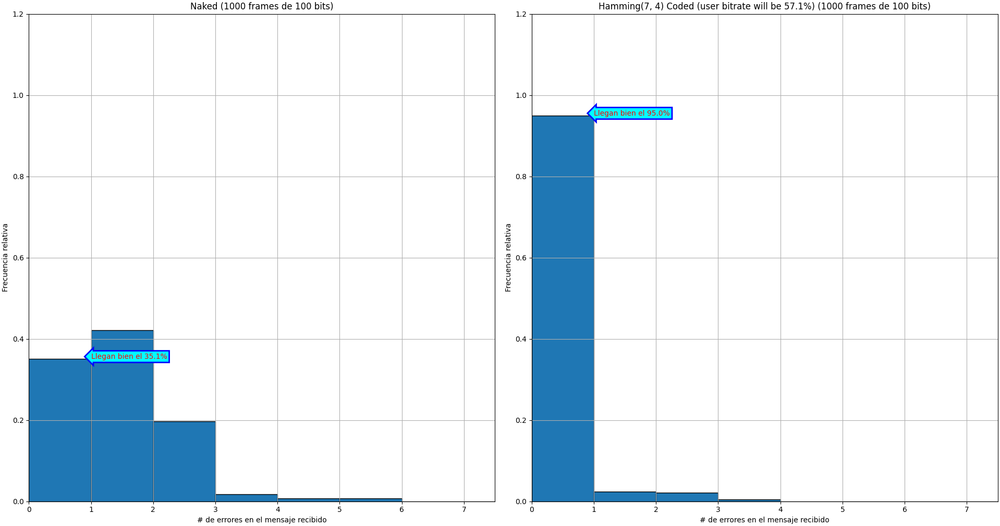

# Jamming

En honor a Ricardo Jamming.

## Preparation

* `python3 -m venv venv`
* `venv/bin/pip install -r reqs.txt`

## Usage

* `venv/bin/python3 jamming.py --help`
* `venv/bin/python3 jamming.py --frame-size 100 --bit-error-prob 0.01 --sample-size 10000`

## Results

