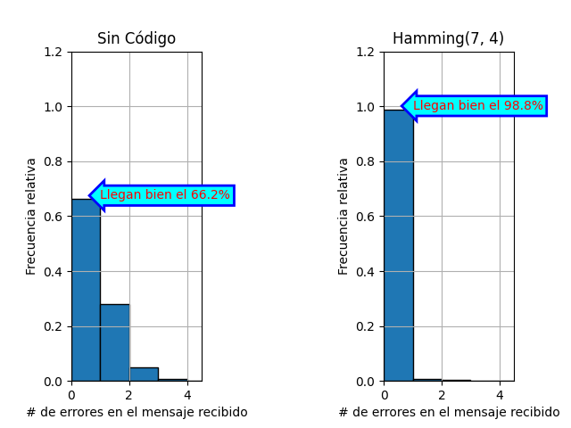
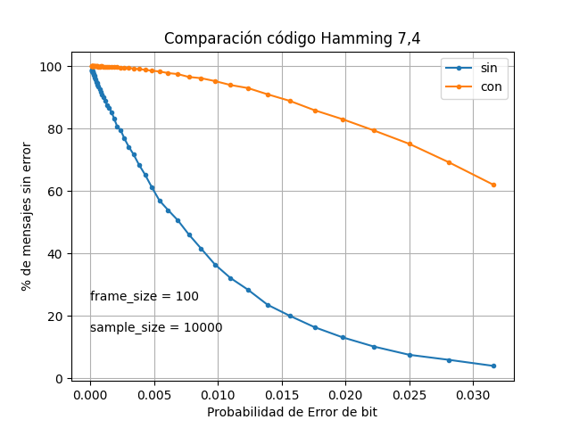

# Jamming

En honor a Ricardo Jamming.

## Examples

* `$ uv run jamming.py comparison --frame-size 100 --bit-error-prob 0.004 --sample-size 10000`

* `$ uv run jamming.py probs --frame-size 100 --sample-size 10000`

